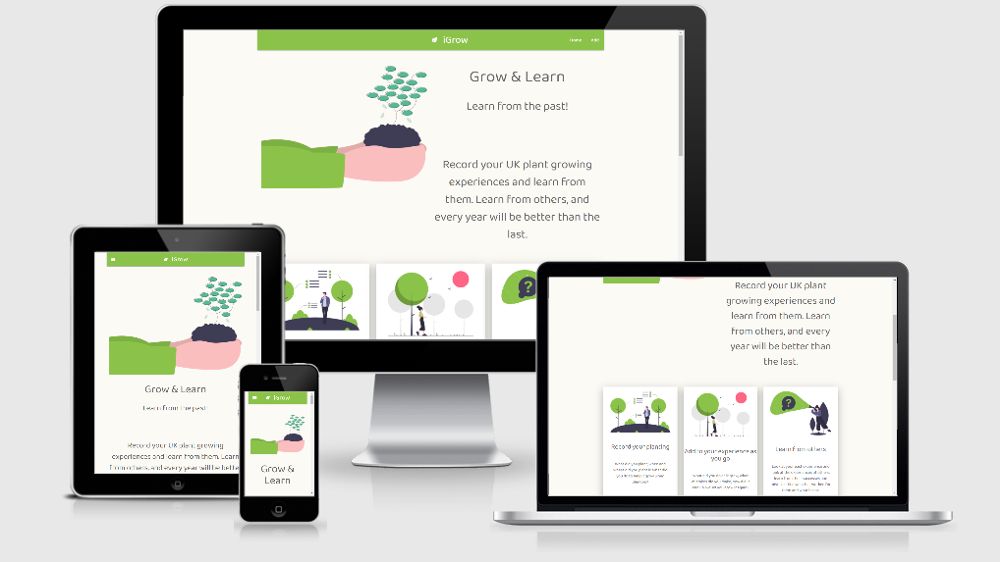

<div align="center">

</div>

---

# iGrow

---

## Aim of the site

This is a site for UK vegetable gardeners. The site will allow anyone to post their growing experience and will allow 
gardeners to learn from themselves and each other . Initially they will record the planting details, 
then as the plant grows during the season, they will record notes on the growing. Finally they will record 
notes on the harvesting. The idea is that they will be able to have a record that allows them to learn from their and others' past 
mistakes and problems, and become better gardeners. As results are very dependent on local growing conditions the scope of the site 
is limited to the UK/ 

[Link to live site](https://i-grow.herokuapp.com/) opens in same tab, click back if needed
---

## User stories

"As a new user: I want to understand what the site does and how it can help me. I want to feel that the site 
will be easy and intuitive, and that it will serve a purpose to me"

"As an existing user: I want a record of the vegetables I have grown over time, I want to know what has been successful for me and for others, and what has failed."

"As an existing user: I want to be able to update records according to the lifecycle of plants throughout the growing season, I want to be able 
to track the various stages of growing and use this information to help me in the future"

"As an existing user: I want this site to be specific to the experience of growing vegetables in my country, and growing conditions in my country, rather than using generalized information 
available on other worldwide sites"

"As an existing user: I want a record of whether what I grow can be considered a success or not"

"As the site owner: I want to ensure that the site is focussed on UK plant growings to best 
serve the target market. Anything beyond this should be deleted"

---

## Site plan, features & wireframes

### Site plan

Click [Here](static/images/siteplan.pdf) for the site plan, opens in same tab, click back if needed

## Features & wireframes
 
### Page 1: Landing page

This page will give an overview of what the site purpose is to the user. It will explain what the site can do to help them, and an overview of how it works. It will also 
display some of records with pagination and search functionality.

- [Landing page desktop & tablet](wireframes/11landingdesktoptablet.png) opens in same tab, press back to return
- [Landing page mobile](wireframes/p1landingmobile.png) opens in same tab, press back to return

### Page 2: Update page

This page will show the chosen individual record details, and allow for all fields to be updated through field entry boxes and an "ADD" button. 

- [Update page desktop & tablet](wireframes/P2updatedesktoptablet.png) opens in same tab, press back to return
- [Update page mobile](wireframes/p2updatemobile.png) opens in same tab, press back to return

### Page 3: Read page

This page will show the chosen individual record. It will have "UPDATE" and "DELETE" buttons.

- [Read page desktop & tablet](wireframes/P3readdesktoptablet.png) opens in same tab, press back to return
- [Read page mobile](wireframes/P3readmobile.png) opens in same tab, press back to return

### Page 4: Create page

This page will give the opportunity for the user to create a planting record. It will also have a button to add the record & return home.

- [Create page desktop & tablet](wireframes/P4createdesktoptablet.png) opens in same tab, press back to return
- [Create page mobile](wireframes/P4createmobile.png) opens in same tab, press back to return

### Page 5: 404 error page

This page will show in the case of a 404 error.

### Page 6: Record not found page

This case will show if a user trys to read a record that cannot be found. for example by using the back buttons or copy/paste post deletion.

---

## Theme & typography

The site will be clean, simple and easy to use. Will not be too busy, or give the user information overload at any stage.

Chosen font used throughout is Baloo Thambi 2, chosen for the clean, simple and easy to read style.

Colours are designed to be soft and pastel like, the below colour palette was generated using [coolors](https://coolors.co/)

<div align="center">

</div>

## Database features

All data is stored in MongoDB in one collection

- Plants - this stores the users records of plantings, designed to be created/updated at three different times:
    - Planting time:
        - Year planted, month planted, what planted, packaging image (an upload of a picture of the seed packet), planting notes
    - Growing time:
        - Growing notes
    - Harvest time:
        - Harvest date, harvest image (an upload of an image of the grown plant), harvest notes and a "Would you grow again?" option

---

## Features left to implement

- User profiles: this will allow signed-in users to have personal profiles and edit their own plantings only

---

## Technologies used

- HTML, CSS & Python languages
- [Google fonts](https://fonts.google.com/) for Baloo Thambo 2 font used through all pages, opens in same tab, press back to return
- [Favicon.io](https://favicon.io/) to generate favicon,opens in same tab, press back to return
- [Gitpod](https://www.gitpod.io/) IDE used to code, opens in same tab, press back to return
- [GitHub](https://github.com/) To host the repositories for this project and the live website preview, opens in same tab, press back to return
- [Balsamiq](https://balsamiq.com/) used to design wireframes, opens in same tab, press back to return
- [Undraw](https://undraw.co/illustrations) used for cartoon images on site, opens in same tab, press back to return
- [Materialize](https://materializecss.com/) framework used for site layout & design
- [Flask](https://flask.palletsprojects.com/en/1.1.x/) as a framework, opens in same tab, press back to return
- [MongoDB](https://www.mongodb.com/) as the database store, opens in same tab, press back to return
- [Coolors](https://coolors.co/) used for colour palette, opens in same tab, press back to return
- [Material Design](https://material.io/resources/icons/?style=baseline) used for icons, opens in same tab, press back to return
- [Hover.css](https://ianlunn.github.io/Hover/) used to add button hover effect , opens in same tab, press back to return
- [Tiny PNG](https://tinypng.com/) used to compress images, opens in same tab, press back to return
- [Heroku](https://dashboard.heroku.com/apps) used to deploy project, opens in same tab, press back to return

---

## Testing

### Code

- **HTML:** All tested with [W3S HTML Validation Service](https://validator.w3.org/), checked by rendering each page in the browser and right clicking to ensure code being rendered excludes the jinja template language
1. 404.html: No errors found
2. base.html: No errors found
3. create.html:  TO DO STILL
4. index.html: No errors found
5. norecord.html: No errors found
6. read.html: No errors found
7. update.html: TO DO STILL

- **CSS:** style.css tested with [W3C CSS Validation Service](https://jigsaw.w3.org/css-validator/validator), no errors found

- **Javascript:** scripts.js tested with [JSLint](https://jslint.com/)

- **Python:** Code tested with pylint: 

---

## Deployment

To deploy this page to Heroku:

1. Create a ```requirements.txt``` file by using the terminal command ```pip freeze > requirements.txt```.
2. Create a ```Procfile``` by using the terminal command ```echo web: python app.py > Procfile```.
3. ```git add``` and ```git commit``` to commit the newly created files, then ```git push``` the project to GitHub.
4. Go to Heroku and create a new app by clicking the "New" button. Give a name and set the region to Europe.
5. From the dashboard, click on "Deploy" > "Deployment method", and select Github.
6. Confirm the linking of the app to the correct Github repository.
In the Heroku dashboard, click "Settings" > "Reveal Config Vars".
7. Set the below config vars:

| Key  | Value  |   
|---|---|
| DEBUG  | FALSE  |  
| IP  | 0.0.0.0  |  
| MONGO_URI  | mongodb+srv://<username>:<password>@<cluster_name>.v4dab.mongodb.net/<database_name>?retryWrites=true&w=majority  |
| PORT  | 5000  |

8. In the Heroku dashboard. click "Deploy".
9. In the "Manual Deployment" section of this page, make sure the master branch is selected then click "Deploy Branch". 

## How to run this project locally

To clone this project from GitHub:

1. Under the repository name, click "Code".
2. In the Clone with HTTPs section, copy the clone URL for the repository. 
3. In your local IDE open Git Bash.
4. Change the current working directory to the location where you want the cloned directory to be made.
5. Type ```git clone```, and then paste the URL you copied in Step 2.
```console
git clone https://github.com/StuartCox3107/iGrow
```
6. Press Enter. Your local clone will be created.
7. Go to the cloned folder and run index.html

Further reading and troubleshooting on cloning a repository from GitHub [here](https://help.github.com/en/articles/cloning-a-repository).

---

### Issues

Bootstrap and materialize used initially until I realised that this causes issues

### Credits & acknowledgements

- [Simen Daehlin](https://github.com/Eventyret) - [The Padwan Project](https://github.com/Eventyret/Padawan) for boilerplate template


---
